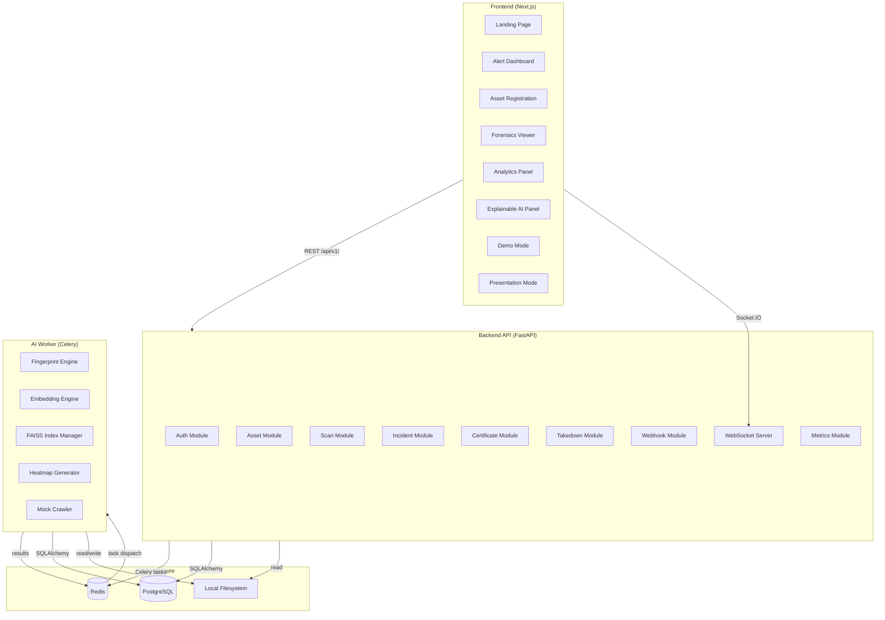

# Design Document: SportShield AI

## Overview

SportShield AI is a full-stack anti-piracy and unauthorized sports media tracking platform. It authenticates official media assets via perceptual fingerprinting and CNN embeddings, detects unauthorized copies across simulated internet sources using FAISS-powered similarity search, and surfaces real-time alerts through a futuristic investor-demo-ready dashboard.

The MVP targets hackathon demonstration with mock crawlers and seeded data, but the architecture is modular and production-scalable. The system is organized as three independently deployable services: a Next.js frontend, a FastAPI backend, and a Python AI worker — all orchestrated via Docker Compose.

### Key Technical Decisions

| Decision | Choice | Rationale |
|---|---|---|
| Similarity search | FAISS (IVF flat index) | Sub-500ms queries at 10k+ embeddings; battle-tested at scale |
| Embedding model | CLIP ViT-B/32 | Strong zero-shot visual similarity; handles crops, color shifts, watermarks |
| Perceptual hash | pHash (imagehash) | Fast, robust to minor edits; complements CNN embeddings |
| Task queue | Celery + Redis | Decouples scan jobs from API; supports 100+ concurrent jobs; retry semantics built-in |
| Real-time transport | Socket.IO | Automatic reconnect, room-based channels, JWT auth middleware |
| Auth | JWT (python-jose) + refresh tokens | Stateless, role-aware, 15-min access / 7-day refresh |
| Database | PostgreSQL + SQLAlchemy | Relational integrity for audit trails; indexed queries for analytics |
| Frontend framework | Next.js 14 (App Router) | SSR for landing page; client components for real-time dashboard |

---

## Architecture



### Request Flow: Asset Registration

```
Client → POST /api/v1/assets/upload
  → FastAPI validates MIME + size
  → Asset record created in PostgreSQL (status: processing)
  → Celery task dispatched: fingerprint_and_embed(asset_id)
  → Response 202 Accepted with asset_id

Celery Worker:
  → Load file from filesystem
  → pHash fingerprint generated
  → CLIP embedding extracted
  → FAISS index updated
  → Certificate generated (SHA-256)
  → Asset status updated to: registered
  → WebSocket event pushed: asset.registered
```

### Request Flow: Scan Job

```
Celery beat / manual trigger → scan_job dispatched
  → Mock crawler generates suspicious_upload record
  → CLIP embedding extracted from suspicious media
  → FAISS.search(embedding, k=1) → (asset_id, distance)
  → distance converted to Match_Score (cosine similarity)
  → IF Match_Score >= threshold:
      → Incident created in PostgreSQL
      → Heatmap generated (GradCAM-style overlay)
      → WebSocket event pushed: incident.created (to org channel)
  → ScanJob status updated: completed
```

---

## Components and Interfaces

### Frontend Pages and Components

| Route | Component | Description |
|---|---|---|
| `/` | `LandingPage` | Hero, problem/solution, architecture diagram, CTA |
| `/dashboard` | `AlertDashboard` | Live feed, summary panels, charts, geo heatmap |
| `/assets` | `AssetRegistry` | Upload UI, asset list, certificate viewer |
| `/assets/[id]` | `AssetDetail` | Metadata, certificate, embedding status |
| `/incidents/[id]` | `ForensicsViewer` | Side-by-side slider, heatmap, XAI panel, takedown |
| `/analytics` | `AnalyticsPanel` | Filterable/sortable table, CSV/PDF export |
| `/metrics` | `MetricsDashboard` | Latency, precision, recall, false positive rate |
| `/demo` | `GuidedDemo` | 5-step walkthrough with auto-advance |
| `/presentation` | `PresentationMode` | Full-screen slide deck |
| `/verify/[hash]` | `CertificateVerify` | Public certificate lookup (no auth) |
| `/architecture` | `ArchitectureDiagram` | SVG pipeline visualization |

Key shared components:
- `GlassCard` — glassmorphism panel wrapper
- `LiveIncidentFeed` — Socket.IO-connected incident list
- `SimilaritySlider` — before/after image comparison
- `HeatmapOverlay` — canvas-based heatmap renderer
- `RoleGuard` — wraps routes with role-based access checks
- `ToastProvider` — global toast notification system
- `SkeletonLoader` — loading state placeholder

### Backend Modules (FastAPI)

```
backend/
  app/
    api/v1/
      auth.py          # /auth/login, /auth/refresh, /auth/logout
      assets.py        # /assets/upload, /assets/, /assets/{id}
      incidents.py     # /incidents/, /incidents/{id}
      scan.py          # /scan/trigger, /scan/jobs, /scan/jobs/{id}
      certificates.py  # /certificates/{hash}
      takedown.py      # /takedown/, /takedown/{id}/transition
      analytics.py     # /analytics/incidents, /analytics/export
      webhooks.py      # /webhooks/ingest
      metrics.py       # /metrics/performance
      demo.py          # /demo/seed, /demo/trigger
    core/
      security.py      # JWT encode/decode, password hashing
      rate_limit.py    # Redis-backed rate limiter
      permissions.py   # Role permission matrix
    models/            # SQLAlchemy ORM models
    schemas/           # Pydantic request/response schemas
    websocket/
      server.py        # Socket.IO server, room management
      events.py        # Event type definitions
    worker/
      tasks.py         # Celery task definitions
      fingerprint.py   # pHash generation
      embedding.py     # CLIP inference
      faiss_index.py   # FAISS index CRUD
      heatmap.py       # Similarity heatmap generation
      crawler.py       # Mock crawler simulation
```

### AI Worker Components

| Component | Library | Responsibility |
|---|---|---|
| `FingerprintEngine` | imagehash (pHash) | Perceptual hash for images and video keyframes |
| `EmbeddingEngine` | PyTorch + CLIP | 512-dim embedding vectors |
| `KeyframeExtractor` | OpenCV | Extract frames at configurable interval |
| `FAISSIndexManager` | faiss-cpu | IVF flat index, add/search/persist |
| `HeatmapGenerator` | OpenCV + NumPy | GradCAM-style overlay on suspicious upload |
| `MockCrawler` | Python stdlib | Simulate YouTube/website/social media ingestion |

---

## Data Models

### User

```python
class User(Base):
    id: UUID (PK)
    email: str (unique, indexed)
    hashed_password: str
    role: Enum[Admin, Sports_League_Manager, Broadcaster_Analyst, Compliance_Officer]
    organization_id: UUID (FK → Organization)
    is_active: bool
    created_at: datetime
    last_login: datetime
```

### Organization

```python
class Organization(Base):
    id: UUID (PK)
    name: str (unique)
    created_at: datetime
```

### Asset

```python
class Asset(Base):
    id: UUID (PK)
    organization_id: UUID (FK → Organization, indexed)
    title: str
    asset_type: Enum[video, image, logo, broadcast_clip]
    file_path: str
    file_size_bytes: int
    duration_seconds: float | None  # video only
    mime_type: str
    status: Enum[uploading, processing, registered, failed]
    fingerprint_hash: str | None
    upload_timestamp: datetime
    created_by: UUID (FK → User)
```

### Embedding

```python
class Embedding(Base):
    id: UUID (PK)
    asset_id: UUID (FK → Asset, indexed)
    keyframe_timestamp: float | None  # None for images
    vector: bytes  # serialized float32 array, 512-dim
    model_version: str  # e.g. "clip-vit-b32"
    created_at: datetime
```

### Certificate

```python
class Certificate(Base):
    id: UUID (PK)
    asset_id: UUID (FK → Asset, unique)
    transaction_hash: str (unique, indexed)
    block_number: int
    fingerprint_hash: str
    organization_name: str
    issued_at: datetime
```

### ScanJob

```python
class ScanJob(Base):
    id: UUID (PK)
    source_type: Enum[youtube, website, social_media]
    source_url: str
    suspicious_media_path: str | None
    status: Enum[pending, running, completed, failed, permanently_failed]
    retry_count: int (default: 0)
    dispatched_at: datetime
    completed_at: datetime | None
    error_message: str | None
    latency_ms: int | None
```

### Incident

```python
class Incident(Base):
    id: UUID (PK)
    scan_job_id: UUID (FK → ScanJob)
    asset_id: UUID (FK → Asset, indexed)
    organization_id: UUID (FK → Organization, indexed)
    source_url: str
    source_type: Enum[youtube, website, social_media]
    match_score: float  # 0.0–1.0
    detection_timestamp: datetime (indexed)
    heatmap_path: str | None
    geo_country: str | None
    resolution_status: Enum[Open, Under_Review, Resolved, Dismissed]
    resolution_updated_at: datetime | None
    resolution_previous_status: str | None
    perceptual_hash_score: float | None
    embedding_score: float | None
    keyframe_match_count: int | None
    tampering_flags: JSON  # {crop, resize, watermark, recompression, color_edit}
```

### TakedownAction

```python
class TakedownAction(Base):
    id: UUID (PK)
    incident_id: UUID (FK → Incident, indexed)
    status: Enum[Draft, Submitted, Acknowledged, Resolved]
    severity: Enum[Low, Medium, High, Critical]
    dmca_draft_text: str | None
    requested_by: UUID (FK → User)
    requested_at: datetime | None
    status_history: JSON  # [{status, timestamp, user_id}]
    created_at: datetime
```

### WebhookEvent

```python
class WebhookEvent(Base):
    id: UUID (PK)
    source_platform: str  # youtube_content_id, meta_rights, etc.
    payload: JSON
    signature_valid: bool
    received_at: datetime
    processed_at: datetime | None
    linked_incident_id: UUID | None (FK → Incident)
    linked_asset_id: UUID | None (FK → Asset)
```

---

## API Design

### Authentication

| Method | Path | Auth | Description |
|---|---|---|---|
| POST | `/api/v1/auth/login` | None | Returns access + refresh tokens |
| POST | `/api/v1/auth/refresh` | Refresh token | Issues new access token |
| POST | `/api/v1/auth/logout` | JWT | Invalidates refresh token |

### Assets

| Method | Path | Auth | Description |
|---|---|---|---|
| POST | `/api/v1/assets/upload` | JWT | Upload single asset (multipart) |
| POST | `/api/v1/assets/bulk-upload` | JWT | Upload up to 50 assets |
| GET | `/api/v1/assets/` | JWT | List assets (org-scoped) |
| GET | `/api/v1/assets/{id}` | JWT | Asset detail + certificate |
| DELETE | `/api/v1/assets/{id}` | JWT (Admin) | Remove asset |

### Incidents

| Method | Path | Auth | Description |
|---|---|---|---|
| GET | `/api/v1/incidents/` | JWT | Paginated list with filters |
| GET | `/api/v1/incidents/{id}` | JWT | Incident detail + XAI data |
| PATCH | `/api/v1/incidents/{id}/status` | JWT | Update resolution status |

### Scan

| Method | Path | Auth | Description |
|---|---|---|---|
| POST | `/api/v1/scan/trigger` | JWT (Admin) | Manually trigger scan cycle |
| GET | `/api/v1/scan/jobs` | JWT | List scan jobs |
| GET | `/api/v1/scan/jobs/{id}` | JWT | Job detail + status |

### Analytics

| Method | Path | Auth | Description |
|---|---|---|---|
| GET | `/api/v1/analytics/incidents` | JWT | Filtered/sorted incident table |
| GET | `/api/v1/analytics/export/csv` | JWT | Export filtered incidents as CSV |
| GET | `/api/v1/analytics/export/pdf` | JWT | Export filtered incidents as PDF |
| GET | `/api/v1/analytics/summary` | JWT | Aggregated stats for dashboard panels |

### Certificates

| Method | Path | Auth | Description |
|---|---|---|---|
| GET | `/api/v1/certificates/{hash}` | None | Public certificate verification |

### Takedown

| Method | Path | Auth | Description |
|---|---|---|---|
| POST | `/api/v1/takedown/` | JWT (Compliance_Officer+) | Create takedown action |
| GET | `/api/v1/takedown/{id}` | JWT | Takedown detail + history |
| POST | `/api/v1/takedown/{id}/transition` | JWT (Compliance_Officer+) | Advance workflow state |
| PATCH | `/api/v1/takedown/{id}/severity` | JWT (Compliance_Officer+) | Update severity level |

### Metrics

| Method | Path | Auth | Description |
|---|---|---|---|
| GET | `/api/v1/metrics/performance` | JWT | Latency, precision, recall, FPR by time window |

### Demo

| Method | Path | Auth | Description |
|---|---|---|---|
| POST | `/api/v1/demo/seed` | JWT (Admin) | Seed 50+ demo incidents |
| POST | `/api/v1/demo/trigger` | JWT (Admin) | Trigger guided demo scenario |

### Webhooks

| Method | Path | Auth | Description |
|---|---|---|---|
| POST | `/api/v1/webhooks/ingest` | HMAC signature | Receive external platform callbacks |

### WebSocket Events

| Event | Direction | Payload | Description |
|---|---|---|---|
| `incident.created` | Server → Client | `{incident_id, asset_id, match_score, source_type, timestamp}` | New incident detected |
| `asset.registered` | Server → Client | `{asset_id, title, status}` | Asset processing complete |
| `scan.job.completed` | Server → Client | `{job_id, status, incident_id?}` | Scan job finished |
| `metrics.updated` | Server → Client | `{latency_ms, precision, recall}` | Performance metrics refresh |
| `demo.step` | Server → Client | `{step, description, data}` | Guided demo step advance |
| `heartbeat` | Server → Client | `{timestamp}` | Keep-alive ping every 30s |
| `subscribe` | Client → Server | `{org_id, channels[]}` | Subscribe to org-specific channels |

---

## AI Detection Pipeline Design

```
Input: suspicious media file (image or video)
  │
  ├─ [Image path]
  │    ├─ pHash generation (imagehash)          → perceptual_hash (64-bit)
  │    └─ CLIP inference (ViT-B/32)             → embedding (512-dim float32)
  │
  └─ [Video path]
       ├─ KeyframeExtractor (OpenCV)            → frames[] at interval N seconds
       └─ For each frame:
            ├─ pHash generation                 → frame_hash
            └─ CLIP inference                   → frame_embedding (512-dim)

FAISS Query:
  embedding → faiss_index.search(embedding, k=1)
  → (asset_id, l2_distance)
  → cosine_similarity = 1 - (l2_distance² / 2)   [for normalized vectors]
  → match_score ∈ [0.0, 1.0]

Threshold Check:
  IF match_score >= threshold (default 0.80):
    → Create Incident
    → Dispatch heatmap_generation task
    → Push WebSocket event

Heatmap Generation (async):
  → Load original asset embedding regions
  → Compute per-region cosine similarity
  → Generate color-coded overlay (OpenCV)
  → Save to filesystem, update Incident.heatmap_path

Explainability Data:
  → perceptual_hash_score: hamming_distance(query_hash, asset_hash) normalized
  → embedding_score: cosine_similarity(query_embedding, asset_embedding)
  → keyframe_match_count: count of frames above threshold
  → tampering_flags: heuristic detection (aspect ratio change → crop/resize, etc.)
```

### FAISS Index Management

- Index type: `IndexFlatIP` (inner product on L2-normalized vectors = cosine similarity)
- Persistence: serialized to disk (`faiss_index.bin`) and reloaded on worker startup
- Updates: new embeddings added incrementally; index rebuilt nightly via Celery beat task
- Sharding: single index for MVP; production path uses `IndexIVFFlat` with `nlist=100`

---

## WebSocket Architecture

```
FastAPI app mounts Socket.IO ASGI app at /ws

Connection lifecycle:
  1. Client connects with ?token=<JWT>
  2. Server validates JWT → extracts user_id, org_id, role
  3. Server joins client to rooms: f"org:{org_id}", f"user:{user_id}"
  4. Server starts 30s heartbeat interval
  5. On disconnect: cleanup rooms, cancel heartbeat

Room-based broadcasting:
  - Incident events → emit to f"org:{org_id}" room
  - Admin-only events → emit to "role:admin" room
  - Demo events → emit to f"demo:{session_id}" room

Redis adapter (python-socketio AsyncRedisManager):
  - Enables multi-worker Socket.IO broadcasting
  - All Celery workers publish events to Redis pub/sub
  - Socket.IO server subscribes and forwards to connected clients
```

---

## Security Design

### Authentication Flow

```
Login → POST /auth/login
  → Verify credentials (bcrypt)
  → Issue access_token (JWT, 15min, HS256)
  → Issue refresh_token (JWT, 7 days, stored hash in DB)
  → Return both tokens

Protected request:
  → Extract Bearer token from Authorization header
  → Decode + verify JWT signature
  → Check expiry
  → Extract role claim
  → Apply permission matrix

Token refresh:
  → POST /auth/refresh with refresh_token
  → Verify refresh_token hash in DB (not revoked)
  → Issue new access_token
  → Rotate refresh_token (invalidate old)
```

### Permission Matrix

| Resource | Admin | Sports_League_Manager | Broadcaster_Analyst | Compliance_Officer |
|---|---|---|---|---|
| Asset CRUD | ✓ | Own org only | Read | Read |
| Incident view | ✓ | Own org only | ✓ | ✓ |
| Incident status update | ✓ | Own org only | ✗ | ✓ |
| Takedown manage | ✓ | ✗ | ✗ | ✓ |
| Analytics export | ✓ | Own org only | ✓ | ✓ |
| User management | ✓ | ✗ | ✗ | ✗ |
| Demo seed | ✓ | ✗ | ✗ | ✗ |

### File Upload Security

1. Check `Content-Type` header
2. Read first 512 bytes → detect MIME via `python-magic`
3. Compare declared extension against detected MIME type
4. Reject mismatch with HTTP 422
5. Check file size against 500 MB limit before writing to disk (stream with size counter)
6. Store files outside web root; serve via signed URL or streaming endpoint

### Rate Limiting

- Redis-backed sliding window counter per `(user_id, endpoint)`
- Default: 100 req/min per user
- Upload endpoints: 10 req/min (heavier operations)
- Returns HTTP 429 with `Retry-After: <seconds>` header

---

## Deployment Architecture

```
docker-compose services:
  frontend:
    build: ./frontend
    ports: 3000:3000
    env: NEXT_PUBLIC_API_URL, NEXT_PUBLIC_WS_URL

  backend:
    build: ./backend
    ports: 8000:8000
    env: DATABASE_URL, REDIS_URL, JWT_SECRET, ...
    depends_on: [db, redis]

  worker:
    build: ./backend          # same image, different CMD
    command: celery -A app.worker worker --loglevel=info
    depends_on: [db, redis]

  beat:
    build: ./backend
    command: celery -A app.worker beat --loglevel=info
    depends_on: [redis]

  db:
    image: postgres:15
    volumes: postgres_data:/var/lib/postgresql/data

  redis:
    image: redis:7-alpine
```

Cloud deployment targets:
- Frontend → Vercel (vercel.json with rewrites for `/api/*` → backend)
- Backend + Worker → Render (separate services from same Docker image)
- Database → Render PostgreSQL or Supabase
- Redis → Upstash Redis (serverless, free tier)

---

## Error Handling

| Scenario | HTTP Status | Behavior |
|---|---|---|
| Invalid JWT | 401 | `{"detail": "Invalid or expired token"}` |
| Insufficient role | 403 | `{"detail": "Insufficient permissions for this resource"}` |
| File too large | 422 | `{"detail": "File exceeds 500 MB limit"}` |
| Unsupported MIME | 422 | `{"detail": "Unsupported file type. Accepted: mp4, mov, avi, jpg, png, webp, svg"}` |
| MIME/extension mismatch | 422 | `{"detail": "File extension does not match detected MIME type"}` |
| Rate limit exceeded | 429 | `{"detail": "Rate limit exceeded"}` + `Retry-After` header |
| Invalid takedown transition | 422 | `{"detail": "Invalid transition from {current} to {target}. Valid next states: {valid}"}` |
| Webhook signature invalid | 401 | `{"detail": "Invalid webhook signature"}` |
| Scan job permanent failure | — | Job marked `permanently_failed`; error logged; no retry |
| FAISS index unavailable | 503 | `{"detail": "Similarity index temporarily unavailable"}` |

Celery task error handling:
- `autoretry_for=(Exception,)`, `max_retries=3`, `retry_backoff=True`
- After 3 retries: `ScanJob.status = permanently_failed`, error logged to structured logger

---

## Testing Strategy

### Unit Tests (pytest)

Focus on pure logic: validation functions, permission checks, hash computation, state machine transitions, CSV serialization, filter/sort logic.

### Integration Tests

- Asset upload → fingerprint → FAISS index round trip
- Scan job dispatch → incident creation → WebSocket event delivery
- Webhook ingestion → incident update
- JWT auth flow (login → refresh → logout)
- Rate limiter behavior under load

### Property-Based Tests (Hypothesis)

See Correctness Properties section. Each property test uses `@given` decorators with Hypothesis strategies, minimum 100 examples per test, tagged with:

```python
# Feature: sportshield-ai, Property N: <property text>
@settings(max_examples=100)
@given(...)
def test_property_N_name(...):
    ...
```

---

## Correctness Properties

*A property is a characteristic or behavior that should hold true across all valid executions of a system — essentially, a formal statement about what the system should do. Properties serve as the bridge between human-readable specifications and machine-verifiable correctness guarantees.*

Property-based testing library: **Hypothesis** (Python). Each property test runs a minimum of 100 iterations.

### Property 1: File type validation accepts only supported formats

*For any* file extension and MIME type pair, the upload validator SHALL accept the pair if and only if both the extension and MIME type are in the supported set, and SHALL reject all other combinations.

**Validates: Requirements 1.1, 1.10**

### Property 2: Asset metadata round-trip preservation

*For any* valid asset upload payload (organization name, title, asset type, file size, duration), the metadata retrieved from the database after registration SHALL be equal to the metadata submitted at upload time.

**Validates: Requirements 1.4**

### Property 3: Bulk upload boundary enforcement

*For any* batch of N files where N ≤ 50, the bulk upload SHALL be accepted; for any batch where N > 50, the bulk upload SHALL be rejected with a descriptive error.

**Validates: Requirements 1.6**

### Property 4: File size limit enforcement

*For any* file whose size in bytes exceeds 500 × 1024 × 1024, the upload SHALL be rejected; for any file at or below that limit with a valid MIME type, the upload SHALL be accepted.

**Validates: Requirements 1.9**

### Property 5: Certificate generation completeness

*For any* successfully registered asset, the generated Certificate SHALL contain a non-null asset ID, organization name, upload timestamp, fingerprint hash, and transaction hash, and all fields SHALL match the values submitted at registration.

**Validates: Requirements 1.11**

### Property 6: Keyframe count invariant

*For any* video asset of duration D seconds registered with keyframe interval I seconds, the number of extracted keyframes SHALL equal ceil(D / I).

**Validates: Requirements 2.1**

### Property 7: Match score range invariant

*For any* embedding vector queried against the FAISS index, the returned Match_Score SHALL be a float in the closed interval [0.0, 1.0].

**Validates: Requirements 2.3**

### Property 8: Self-similarity invariant

*For any* registered asset, querying the FAISS index with the embedding derived from that same asset SHALL return a Match_Score of 0.95 or higher.

**Validates: Requirements 2.8**

### Property 9: Threshold-based incident creation

*For any* scan result where Match_Score ≥ configured threshold, an Incident record SHALL be created; for any scan result where Match_Score < threshold, no Incident SHALL be created.

**Validates: Requirements 2.5**

### Property 10: Configurable threshold range enforcement

*For any* threshold value T where 0.50 ≤ T ≤ 0.99, the system SHALL accept the configuration; for any T outside that range, the system SHALL reject it with a descriptive error.

**Validates: Requirements 2.6**

### Property 11: Scan job retry count invariant

*For any* scan job that fails on every attempt, the system SHALL retry it at most 3 times before marking it as permanently failed, and the retry count SHALL never exceed 3.

**Validates: Requirements 3.8**

### Property 12: Demo data completeness

*For any* invocation of the demo data generator, the resulting incident set SHALL contain at least 50 records, each with a non-null Match_Score, source type, detection timestamp, and geographic origin.

**Validates: Requirements 3.6**

### Property 13: Certificate hash determinism

*For any* (fingerprint_hash, organization_id, upload_timestamp) triple, computing the certificate transaction hash twice SHALL produce identical results.

**Validates: Requirements 6.4**

### Property 14: Incident filter correctness

*For any* set of incidents and any filter predicate (date range, source type, Match_Score range, asset name, resolution status), every incident returned by the filter SHALL satisfy all active filter criteria, and no incident satisfying all criteria SHALL be omitted.

**Validates: Requirements 7.2**

### Property 15: Incident sort ordering invariant

*For any* list of incidents sorted by column C in direction D, every adjacent pair (i, i+1) in the result SHALL satisfy the ordering relation for column C in direction D.

**Validates: Requirements 7.3**

### Property 16: CSV export round-trip completeness

*For any* filtered set of incidents exported to CSV, parsing the CSV SHALL yield a record count equal to the filtered incident count, and each record SHALL contain all required column values.

**Validates: Requirements 7.5**

### Property 17: Resolution status transition audit

*For any* incident whose resolution status is updated, the system SHALL record the previous status value and the update timestamp, and the recorded previous status SHALL equal the status that was active immediately before the update.

**Validates: Requirements 7.8**

### Property 18: Takedown workflow order enforcement

*For any* takedown action, attempting a state transition that skips a step or moves backward in the sequence Draft → Submitted → Acknowledged → Resolved SHALL be rejected with a descriptive error.

**Validates: Requirements 13.7**

### Property 19: MIME type and magic bytes validation

*For any* uploaded file where the file extension does not match the MIME type detected from the file's magic bytes, the upload SHALL be rejected.

**Validates: Requirements 15.3**

### Property 20: Rate limit response correctness

*For any* authenticated user who sends more than the configured request limit within the rate window for a given endpoint, every request beyond the limit SHALL receive an HTTP 429 response containing a `Retry-After` header with a positive integer value.

**Validates: Requirements 15.5, 15.6**

### Property 21: WebSocket authentication enforcement

*For any* WebSocket connection attempt carrying an invalid, expired, or absent JWT token, the connection SHALL be rejected before any events are delivered.

**Validates: Requirements 21.4**
